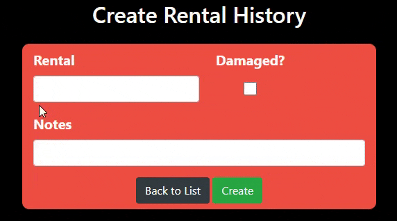

# C# Live Project 
## Introduction
**Role:** Developer <br>
**Tech Stack:**  C#, ASP.NET MVC, Entity Framework, Bootstrap, HTML/CSS, Git <br>

&emsp;For the final two weeks of [The Tech Academy](https://www.learncodinganywhere.com/) program, I participated in the C# Live Project where I worked with a team of developers to contribute to a real-world web application called TheatreCMS3. This application serves as a comprehensive management system for a theater’s website, with features that cover rentals, events, performances, and user interactions.

&emsp;Working in an Agile environment, we followed Scrum methodologies, including daily stand-ups, sprint planning, retrospectives, and task estimation. Much of the site had already been built, giving us the challenge of contributing to a legacy codebase—learning how to extend functionality, fix bugs, and follow established coding patterns.

&emsp;During the 8-day sprint, I was assigned to work primarily on the Rentals area of the site. I created and updated models and views for RentalItems and RentalHistories using Entity Framework. I also collaborated with other team members on UX improvements, code cleanup, and logic refactoring. The experience helped me improve both my C# and version control skills, giving me the confidence to integrate clean code into a shared repository and navigate unfamiliar codebases effectively.

## Core Technologies
* Backend: C#, ASP.NET MVC, Entity Framework
* Frontend: HTML, CSS, Bootstrap 4.6.0, Razor Views
* Database: SQL Server, Entity Framework ORM
* Version Control: Git, GitHub
* Development Tools: Visual Studio, SQL Server Management Studio

## Key Stories and Features I Worked On
1. [RentalHistory Model CRUD](#rentalhistory-model-crud)
2. [RentalHistory Create Edit](#rentalhistory-create-edit)
3. [RentalHistory Index](#rentalhistory-index)
4. [RentalHistory Sorting](#rentalhistory-sorting)
5. [RentalItem Model CRUD](#rentalitem-model-crud)
6. [RentalItem Photo](#rentalitem-photo)
7. [RentalItem Create Edit](#rentalitem-create-edit)
8. [RentalItem Index](#rentalitem-index)
9. [RentalItem Details Delete](#rentalitem-details-delete)
10. [RentalItem Index Search](#rentalitem-index-search)
11. [RentalItem Create Photo](#rentalitem-create-photo)
##

*Jump To: [Introduction](#introduction), [Key Stories and Features I Worked On](#key-stories-and-features-i-worked-on), [RentalHistory Index](#rentalhistory-index), [RentalItem Model CRUD](#rentalitem-model-crud), [RentalItem Index](#rentalitem-index), [RentalItem Index Search](#rentalitem-index-search), [Key Takeaways](#key-takeaways)*
##

### RentalHistory Model CRUD 
&emsp;My first major task on the project was to create the RentalHistory entity model and scaffold the corresponding CRUD pages to allow users to create, view, edit, and delete rental history records. I began by defining the model based on a provided schema and integrating it into the existing codebase under the Areas > Rental folder. 
```
using System;
using System.ComponentModel.DataAnnotations;
using System.ComponentModel.DataAnnotations.Schema;
using System.Collections.Generic;
using System.Linq;
using System.Web;

namespace TheatreCMS3.Areas.Rent.Models
{
    public class RentalHistory
    {
        [Key]
        public int RentalHistoryId { get; set; }
        public string Renter { get; set; }
        public string Rental { get; set; }
        public bool RentalDamaged { get; set; }
        public string DamagesIncurred { get; set; }
    }
}
```
To ensure database connectivity, I registered the new model with the existing ApplicationDbContext in IdentityModels.cs, then used Visual Studio's scaffolding tools to generate the controller and views for standard CRUD operations. All generated pages were configured to use the site-wide _Layout.cshtml file for a consistent UI. After scaffolding, I updated the database and verified that the new RentalHistories table had been correctly created using SQL Server Object Explorer. Once everything was in place, I tested each route to confirm that rental history records could be successfully added, viewed, edited, and deleted within the application.
##

### RentalHistory Create Edit
&emsp;After scaffolding the basic CRUD pages for the RentalHistory model, I focused on improving the layout and functionality of the Create and Edit forms to match the desired UI shown in a provided design reference. I styled both forms to limit the content width to 600 pixels and arranged the Rental dropdown and RentalDamaged checkbox on the same line for a cleaner, more intuitive layout. Additionally, I brought the "Back to List" button inside the form and centered it alongside the primary action button to improve visual balance and user flow. To enhance interactivity, I wrote a jQuery script that dynamically updated the label for the DamagesIncurred field based on whether the RentalDamaged checkbox was checked. When checked, the label reads “Damages Incurred”; when unchecked, it switches to “Notes.” This made the form both visually polished and responsive to user input, aligning with TheatreCMS3's UX practices.
</br>
<p align=center>

</p>

##

### RentalHistory Index 
&emsp;The next part of the RentalHistory implementation involved redesigning the Index view to present all records in a clean, styled table format using Bootstrap and Font Awesome. I replaced the default scaffolded table layout with a custom Bootstrap-styled grid to better match the provided design. For each rental history entry, I implemented logic to display a green checkmark icon if the rental was not damaged, and a red X icon if it was — both using Font Awesome, which was already included in the project. To visually distinguish the rental name, I styled it with a Bootstrap badge directly after the icon. Following that, the DamagesIncurred or Notes text was displayed inline, with a slight grey-out effect applied to undamaged rentals. I also made sure that this text would not wrap or overflow; instead, long content is gracefully truncated with ellipses for a cleaner layout. Finally, I added a hover effect so that vertical ellipses (⋮) appear when hovering over a row, which triggers a dropdown menu containing the Edit, Details, and Delete actions — improving usability while keeping the interface streamlined.
```
<td class="text-right position-relative">
    <div class="dropdown rentalhistory-index--dropdown">
        <button class="btn btn-link text-dark p-0" data-toggle="dropdown">
            <i class="fas fa-ellipsis-v"></i>
        </button>
        <div class="dropdown-menu dropdown-menu-right">
            <a class="dropdown-item" href="@Url.Action("Edit", new { id = item.RentalHistoryId })">
                <i class="fas fa-pen-square mr-2 text-dark"></i> Edit
            </a>
            <a class="dropdown-item" href="@Url.Action("Details", new { id = item.RentalHistoryId })">
                <i class="fas fa-info-circle mr-2 text-dark"></i> Details
            </a>
            <div class="dropdown-divider"></div>
            <a class="dropdown-item text-danger" href="@Url.Action("Delete", new { id = item.RentalHistoryId })">
                <i class="fas fa-trash-alt mr-2"></i> Delete
            </a>
        </div>
    </div>
</td>
```
##

### RentalHistory Sorting
&emsp;To enhance the usability of the RentalHistory index view, I implemented sorting functionality that allows users to filter and reorder results dynamically. By default, all RentalHistory records are displayed from most recent to oldest, ensuring that the most relevant data appears first. To provide additional sorting options, I added a select dropdown menu positioned flush to the right side of the RentalHistories list. The options include: No Extra Sorting, Damaged Rentals, Undamaged Rentals, Rentals A–Z, and Rentals Z–A. Selecting one of these options triggers a JavaScript function that sends an Ajax request to a controller action, which returns a sorted partial view without requiring a full page reload. This approach keeps the page responsive and allows for server-side data accuracy while delivering a smooth user experience. On the backend, I handled sorting logic using LINQ, applying the correct order or filters based on the user's selection. This feature gave users an intuitive and efficient way to navigate rental history data.
</br>
<p align=center>

</p>

##

### RentalItem Model CRUD
&emsp;As my work transitioned from RentalHistory to the broader Rentals feature, I began by creating the RentalItem entity model, based on a provided schema. The goal was to enable storage and management of individual rental items in the database. I first defined the RentalItem class, then registered it with the existing ApplicationDbContext in IdentityModels.cs, ensuring it integrated with the project's central data layer. Before scaffolding, I commented out the ItemPhoto property as instructed, since that feature was reserved for a later task.
```
using System;
using System.ComponentModel.DataAnnotations;
using System.ComponentModel.DataAnnotations.Schema;
using System.Collections.Generic;
using System.Linq;
using System.Web;

namespace TheatreCMS3.Areas.Rent.Models
{
    public class RentalItem
    {
        [Key]
        public int RentalItemId { get; set; }
        public string Item { get; set; }
        public string ItemDescription { get; set; }
        public DateTime PickupDate { get; set; }
        public DateTime? ReturnDate { get; set; }

        [ScaffoldColumn(false)]
        public byte ItemPhoto { get; set; }
    }
}
```
&emsp;Using Visual Studio's scaffolding tools, I generated a controller and full set of CRUD views (Index, Create, Edit, Details, and Delete), making sure to apply the shared layout (_Layout.cshtml) for consistent navigation and styling across the app. I confirmed that only one controller and one set of views were created for this model. After running a migration and updating the database, I verified that the RentalItems table had been correctly created using SQL Server Object Explorer. Once complete, I navigated through each view to ensure that rental items could be added, edited, viewed, and deleted as expected.
##

### RentalItem Photo
&emsp;Once the RentalItem model and CRUD views were in place, I enhanced the feature by implementing image upload and retrieval functionality. This allowed users to upload photos when creating or editing a rental item. I began by uncommenting the ItemPhoto property in the model and adding a file input field to both the Create and Edit views. On the controller side, I wrote a helper method that accepts an uploaded image file (HttpPostedFileBase), reads it into a stream, and converts it to a byte[]. This byte array is then assigned to the ItemPhoto property of the model and stored in the database alongside the other rental item details.

&emsp;To retrieve and display the image, I created a controller method that takes the ID of a RentalItem, fetches the associated byte array, and returns it as a FileContentResult. I then configured the RentalItem Index page to display each rental's photo using an  tag whose src attribute calls this image-serving controller method. This allowed images to be loaded dynamically from the database and rendered directly in the UI. The result is a responsive, database-backed photo feature that enhances the visual presentation of rental items.
```
public FileContentResult GetImage(int id)
{
    var item = db.RentalItems.Find(id);
    if (item?.ItemPhoto != null)
    {
        return File(item.ItemPhoto, "image/jpeg"); // or image/png
    }
    return null;
}
```
##

### RentalItem Create Edit
&emsp;After implementing functionality for creating and editing RentalItem records, I focused on enhancing the visual design and user experience of the forms. I began by adding a clean, centered header—“Create Rental Item” or “Edit Rental Item”—above each form to clearly indicate the page’s purpose. I wrapped the entire form in a responsive, centered container and applied consistent spacing and padding to align it with the rest of the site’s design. To improve usability, I added meaningful placeholder text to all input fields and styled the form elements to match the application’s theme.

&emsp;I also customized the form’s interactivity: input fields now change background color and display a themed orange border when focused, creating a subtle but effective user cue. For the form controls, I styled both the “Submit” and “Back to List” buttons with distinct colors, rounded corners, and hover effects. These buttons are now centered and visually differentiated, making the page both more attractive and intuitive to navigate. The result is a polished, user-friendly form experience that aligns with the project’s overall visual identity.
</br>
<p align=center>

</p>

##

### RentalItem Index
&emsp;The next major enhancement to the RentalItem feature involved fully redesigning the Index page to replace the default scaffolded table with a responsive, image-forward card layout. I began by converting the “Create New” text link into a styled Bootstrap button for better visual consistency. I then built out a grid of Bootstrap cards, each representing a RentalItem from the database. These cards included the item’s image, name, and a clean layout to improve visual engagement.
</br>
<p align=center>

</p>

&emsp;To add interactivity, I implemented an image overlay on hover: the image slightly darkens and reveals two Font Awesome icon buttons for editing and deleting the rental item. These buttons were styled to match the site’s theme and offer clear feedback on hover. Each entire card was also made clickable, linking to the RentalItem’s Details view — giving users a seamless navigation experience without relying solely on small text links. This overhaul made the Index page much more visually appealing and aligned it with modern UI patterns, significantly improving both aesthetics and usability.
##

### RentalItem Details Delete
&emsp;To complete the RentalItem user experience, I added styling to the Details and Delete views, which were originally left in their default scaffolded state. I centered the content on both pages for improved readability and visual balance, replacing the original left-aligned layout. Key fields—such as RentalItem, ItemPhoto, and ItemDescription—were given more visual prominence by increasing font size and weight, allowing users to quickly identify the most important details at a glance.

&emsp;On the Delete page, I styled the primary action buttons with custom Bootstrap classes and Font Awesome icons to visually distinguish their purpose: a red Delete button with a trash icon, a Back to List button with a left-arrow icon, and an Edit button with a pencil icon. The Details page follows the same layout and styling, minus the Delete button, creating consistency across the views. These improvements not only made the pages more visually appealing but also added clear action indicators, improving the overall usability of the feature.
##

### RentalItem Index Search
&emsp;To enhance navigation and usability on the RentalItem Index page, I implemented a search feature that allows users to find rental items by name or keywords in their descriptions. I added a search bar to the top-right corner of the page, styled to match the overall theme of the site. When a user enters a term and submits the form, the page reloads and displays only those RentalItem cards that contain the matching text in either the RentalItemName or ItemDescription fields.
```
<div class="container rentalItem-index--card-container">
    <div class="row">
        @if (Model != null && Model.Any())
        {
            foreach (var item in Model)
            {
                <div class="col-lg-3 col-md-4 col-sm-6 mb-4">
                    <div class="rentalItem-index--card" tabindex="0" role="button" onclick="location.href='@Url.Action("Details", new { id = item.RentalItemId })'">
                        @if (item.ItemPhoto != null)
                        {
                            
                        }
                        else
                        {
                            <div class="rentalItem-index--no-image">No Image</div>
                        }

                        <div class="rentalItem-index--overlay">
                            <a href="@Url.Action("Edit", "RentalItems", new { id = item.RentalItemId, area = "Rent" })"
                               class="rentalItem-index--icon-link" title="Edit">
                                <i class="fas fa-edit"></i>
                            </a>
                            <a href="@Url.Action("Delete", "RentalItems", new { id = item.RentalItemId, area = "Rent" })"
                               class="rentalItem-index--icon-link" title="Delete">
                                <i class="fas fa-trash-alt"></i>
                            </a>
                        </div>
                    </div>
                </div>
            }
        }
        else
        {
            // Hide the whole section if no results found (or no items at all)
            <div class="col-12">
                <p class="text-center">No rental items found.</p>
            </div>
        }
    </div>
</div>
```
&emsp;The search logic is handled server-side, filtering the results before the view is rendered. If no matches are found, the card section is hidden entirely, and a fallback message can be shown if desired. This solution provides a seamless and efficient way to navigate large lists of rental items without overwhelming the user. It also prepares the project for future enhancements, such as real-time filtering or category-based search.
##

### RentalItem Create Photo
&emsp;To improve the usability and responsiveness of the RentalItem Create page, I implemented a live image preview feature. When a user selects a photo file to upload for a rental item, a thumbnail preview of the image is immediately displayed within the form—before the item is actually created. This gives users immediate visual confirmation that they’ve selected the correct file, reducing the risk of uploading the wrong image.
</br>
<p align=center>

</p>

&emsp;This functionality was implemented using JavaScript. I added an event listener to the file input field that triggers when a file is selected. The script reads the image using a FileReader and sets the result as the src for an  element within the form. The preview is styled to match the rest of the form layout and adjusts responsively depending on the image size. This feature adds a layer of professionalism and convenience to the user interface, closing out the RentalItem CRUD feature set with a strong finish.
##

*Jump To: [Introduction](#introduction), [Key Stories and Features I Worked On](#key-stories-and-features-i-worked-on), [RentalHistory Index](#rentalhistory-index), [RentalItem Model CRUD](#rentalitem-model-crud), [RentalItem Index](#rentalitem-index), [RentalItem Index Search](#rentalitem-index-search), [Key Takeaways](#key-takeaways)*
##

## Conclusion
&emsp;Participating in the C# Live Project was an incredibly valuable experience that allowed me to apply my technical skills in a real-world, team-based setting. Working within a legacy ASP.NET MVC codebase taught me the importance of clean architecture, consistent coding patterns, and collaborative version control. From implementing database-backed models to enhancing the UI with Bootstrap and JavaScript, I gained confidence in full-stack development. The Agile environment reinforced the importance of communication, adaptability, and iterative improvement—all critical skills for any developer entering the professional workforce.

## Key Takeaways
* **C# and .Net:** Furthered my knowledge of C# and .Net, how they work together, and how they differ from other languages and platforms.
* **Legacy Codebase Navigation:** Improved my ability to read and extend existing code with minimal disruption.
* **Entity Framework Proficiency:** Deepened my understanding of model creation, relationships, migrations, and data context management.
* **Frontend Styling & UX:** Styled Razor views with Bootstrap and enhance interactivity using JavaScript and jQuery.
* **Image Handling:** Gained experience with file uploads, image previews, and serving binary image data from a database.
* **AJAX and Partial Views:** Implemented dynamic sorting using Ajax, improving responsiveness without full page reloads.
* **Team Collaboration:** Practiced Git workflows in a team setting, including branching, merging, and resolving merge conflicts.
* **Agile Practices:** Participated in daily stand-ups, sprint planning, and retrospectives, strengthening my project management and communication skills.
* **Time Management:** Balanced multiple tasks within sprint deadlines, prioritizing features and fixing bugs efficiently.
* **Debugging and Testing:** Enhanced problem-solving abilities by diagnosing UI and logic issues in a complex MVC application.
  * One of several bugs I caught involved the image displays malfunctioning on both the RentalItem Create and Edit pages. I had to go back and rework the JS and CSHTML code to make sure I eliminated any overlaps and name confusion.

##

*Jump To: [Introduction](#introduction),  [Key Features & Functionality](#key-features--functionality), [Display All Items](#display-all-items), [Connect to API](#connect-to-api), [BeautifulSoup Setup](#beautifulsoup-setup), [Front-End Improvements](#front-end-improvements), [Conclusion](#conclusion), [Key Learnings & Challenges](#key-learnings--challenges)*
